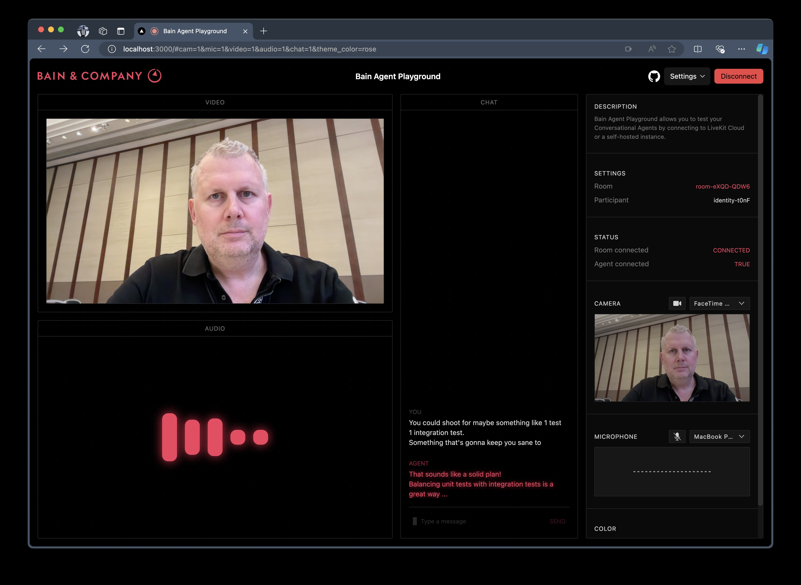

# Bain Agent Playground



Bain Agent Playground is a real-time Conversational Agent demonstration for testing voice agents. It uses:

- [LiveKit](https://livekit.io) WebRTC as the event major backbone
- [Deepgram](https://deepgram.com) Speech-to-Text API
- [OpenAI](https://openai.com/) ChatGPT API

## TL;DR

```bash
# Copy and add your API keys to env.bash
cp agents-backend/env.example agents-backend/env.bash 

# Copy and add your API keys to env.local
cp agents-frontend/.env.example agents-frontend/.env.local

# Run docker compose
docker-compose up

# Now connect to the frontend
open http://localhost:3000
```

## Playground Assistant types

There are two types of assistant examples included in this project:

- **[Voice Assistant](agents-backend/voice-assistant.py)**
  - Is a basic conversational agent you can talk to in real time.
  - It uses GPTo to generate responses and can be interrupted by the user.
  - You can interrupt the Assistant while it's speaking.
  - It relies on GPTo for general knowledge.

- **[Video Assistant](agents-backend/video-assistant.py)**
  - Has the same basic conversational capabilities as Voice Assistant.
  - Additionally, it supports vision capabilities for analyzing and describing an image, a video, or a webcam feed.
  - Triggering the vision capabilites is done by asking the Assistant things such as:
    - _"What can you see in my video feed?"_
    - _"What am I holding in my web cam?"_
    - _"What is the value of Temperature in the paper in my video?"_

## Manual installation

First, create a virtual environment, update pip, and install the required packages:

```bash
cd agents-backend

python3 -m venv .venv
source .venv/bin/activate

pip install -U pip
pip install -r requirements.txt

cp env.example env.bash
```

You need to set up the following environment variables in `env.bash` and `.env.local.` You can sign up for all accounts with the free tier.

```bash
LIVEKIT_URL=...
LIVEKIT_API_KEY=...
LIVEKIT_API_SECRET=...
DEEPGRAM_API_KEY=...
OPENAI_API_KEY=...
```

Then, run the backend assistant:

```bash
cd agents-backend
./run.sh [voice | video]
```

Finally, you want to run the Agent Playground UI:

```bash
cd agents-frontend
cp .env.example .env.local

npm install
npm run dev
```

Then navigate to <http://localhost:3000> and click the "Connect" button.

**Note:** The first time you connect, you will be prompted to allow the browser to access your microphone and camera.
